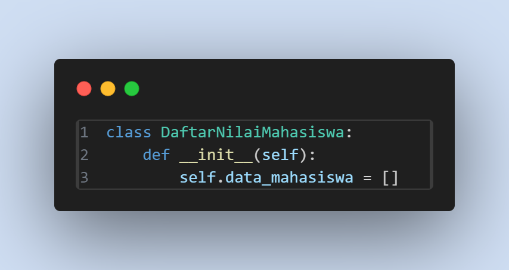
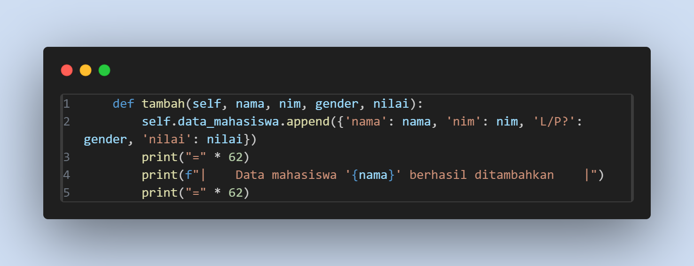
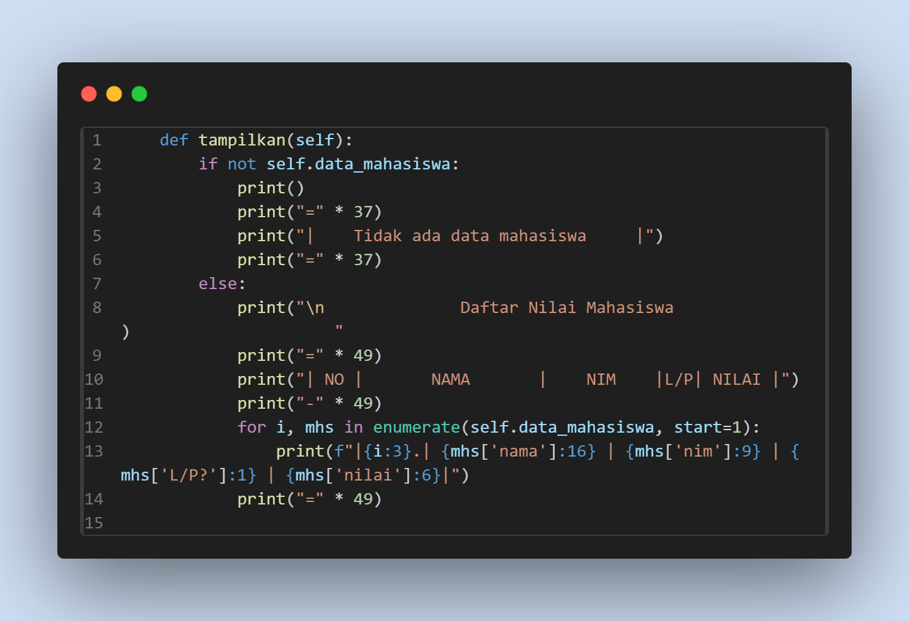
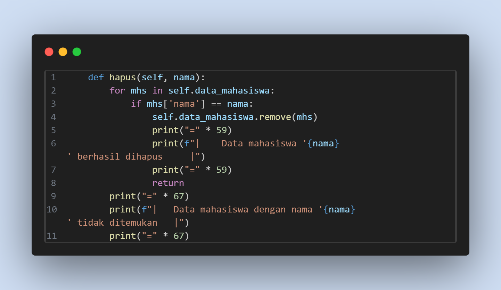
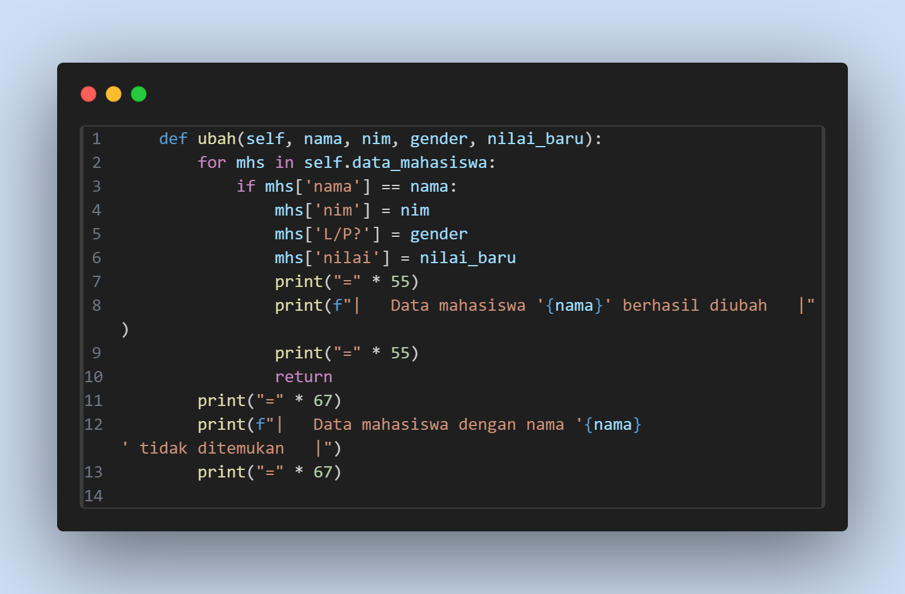
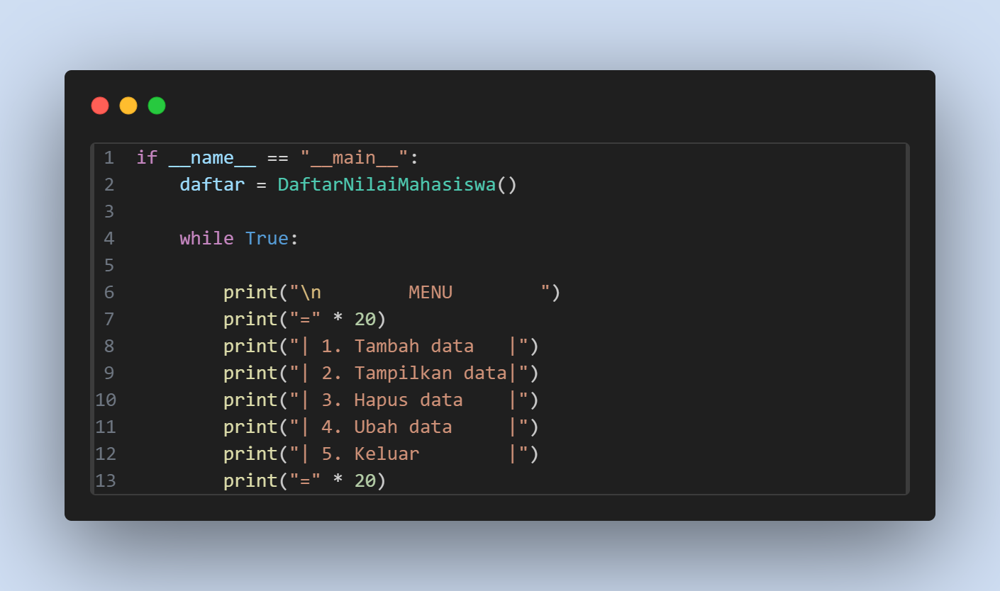
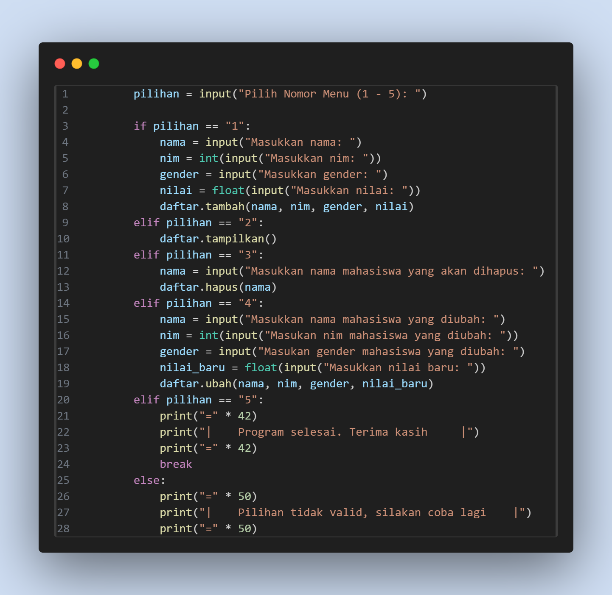
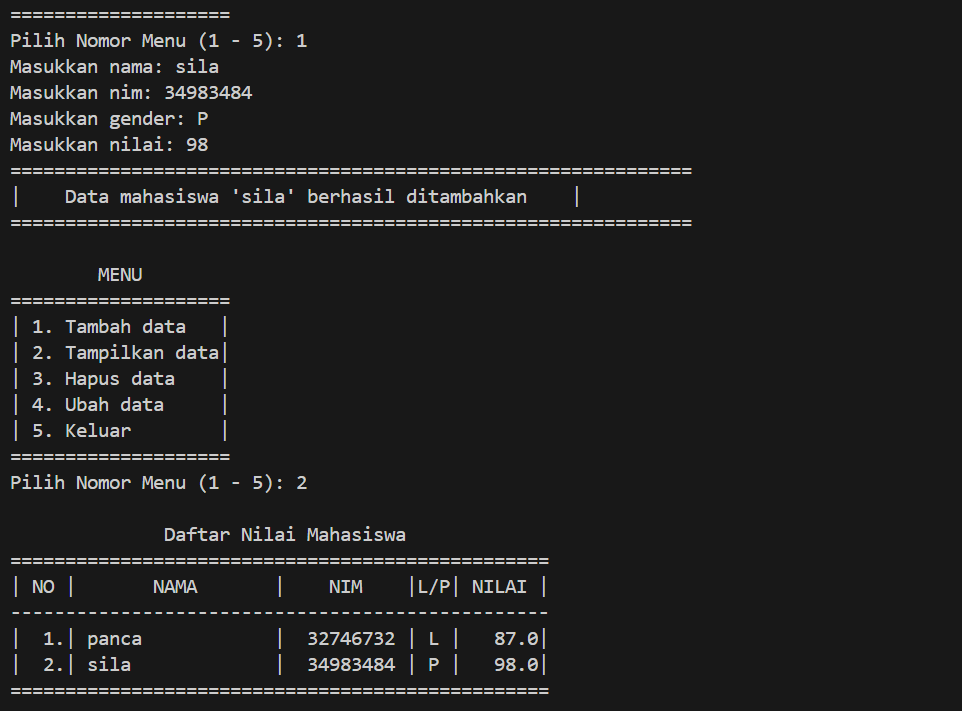

# praktikum8

# 1. Class DaftarNilaiMahasiswa dan Method init
kelas yang dilampirkan adalah struktur utama untuk mengelola data mahasiswa. Seperti menambah, menampilkan, menghapus,
dan mengubah data.
selai itu method init adalah kontrukstor yang dijalankan saat kelas ini dibuat. atribut data_mahasiswa di inilisasi
sebagai list kosong untuk menyimpan data mahasiswa

# 2. Method Tambah
Method ini digunakan untuk menambah data mahasiswa baru kedalam list data_mahasiswa. Data disimpan sebagai dictionary dalam
kunci Nama, Nim, L/P, dan Nilai.

# 3. Method Tampilkan
Method ini mencetak daftar mahasiswa baru yang sudah tersimpan. Jika daftar kosong, akan menampilkan pesan "Tidak ada data mahasiswa".
namun ketika tidak kosong, data tampilan dalam bentuk tabel yang berisi Nama, Nim, Gender, dan Nilai.

# 4. Method Hapus
Method hapus ialah untuk menghapus data mahasiswa dengan kerja program mencari sebuah nama yang telah di input, jika ada maka
program akan menghapus nama tersebut.

# 5. Method Ubah
Method ini akan mengubah suatu nama dari daftar mahasiswa, jika nama ditemukan data seperti Nim, Gender, dan Nilai akan diubah.

# 6. Fungsi Main dan Menu Interaktif
Bagian ini adalah titik awal program. Program berjalan dalam loop yang menawarkan menu interaktif kepada user untuk memilih salah
satu opsi.

# Hasil Code Program

# Flowchart

